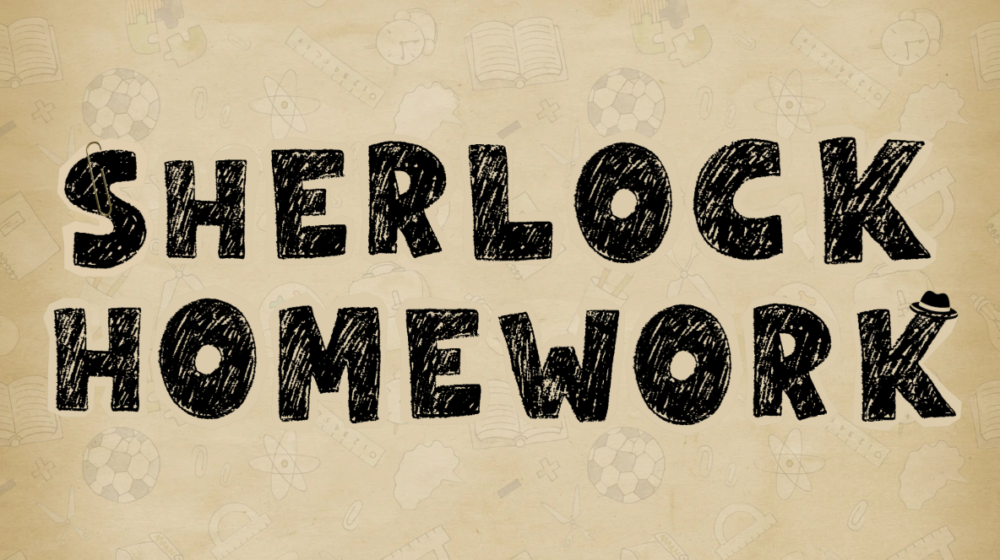

  
  

    <i> Click this header to play the game!</i>
  

# 🔍 Sherlock Homework

**Sherlock Homework** is a non-immersive VR educational experience built with Unity WebGL. It transforms the classroom into a crime scene, challenging Grade 6 Filipino students to close "Case Files" by blending academic mastery with sharp detective intuition.

---

## 📂 The Case File: Project Overview
**Status:** *Investigation Ongoing* **Objective:** Address the critical thinking gap in Philippine education.  

National assessments (NAT 2018) reveal a cold truth: Grade 6 students averaged only **33.6%** in reasoning. **Sherlock Homework** bridges this gap using **Scaffolding Learning**, forcing "student detectives" to analyze evidence, interrogate claims, and apply curriculum concepts to solve real-world mysteries.

### 🎯 Mission Directives
* **Analyze the Field:** Deploy a three-level prototype across the core territories of Math, Science, and English.
* **Interrogate the Narrative:** Implement a high-stakes dialogue system where attentive reading is the difference between solving the case and a dead end.
* **Close the Gap:** Support **SDG 4 (Quality Education)** by providing an accessible, high-quality investigative platform for all.

---

## 📋 Evidence Log: Level Breakdown

| Case Level | Subject | Investigative Core |
| :--- | :--- | :--- |
| **File #001** | **Mathematics** | Percentages, Discounts, & Financial Verification |
| **File #002** | **English** | Grammar, Syntax, & Logical Deduction |
| **File #003** | **Science** | States of Matter (Thermal Analysis) |

---

## 🕵️‍♂️ Detective Mechanics
* **The Cross-Examination:** Don't take their word for it. Review NPC statements, sniff out logical fallacies, and present the "Smoking Gun" clue to crack a false claim.
* **Forensic Evaluation:** Get hands-on with the evidence. Inspect receipts for math errors or lab equipment for scientific anomalies (like partially melted ice).
* **Scholastic Noir Aesthetic:** Immerse yourself in a world of coffee-stained paper textures, marker-drawn UI, and low-opacity academic motifs.
* **The Briefing (Adaptive Feedback):** Instant post-action reports help detectives learn from their tactical errors and improve their reasoning for the next lead.

---

## 👥 Team

  <a href="github.com/BigDrewChicken"> Ross Andrew Bulaong</a> 
  <a href='https://github.com/serv22'> Serge Esguerra<a/>  
  <a href='https://github.com/qdalmadriago-pixel'> Dave Adriene Madriago<a/>  
  <a href='https://github.com/CHARLESYEXELPALOMARES'> Charles Yexel Palomares<a/>  
  <a href='https://github.com/jamierosereyes'> Jamie Kia Rose Reyes<a/>  

---

> <i>“Education never ends, Watson. It is a series of lessons, with the greatest for the last.”</i> 
> ― Sir Arthur Conan Doyle, His Last Bow
---

  

    Developed in alignment with <b>United Nations Sustainable Development Goal 4: Quality Education</b>.
    Our final project for the subject Interactive Extended Reality (part of the Human Computer Interaction track elective)
  

